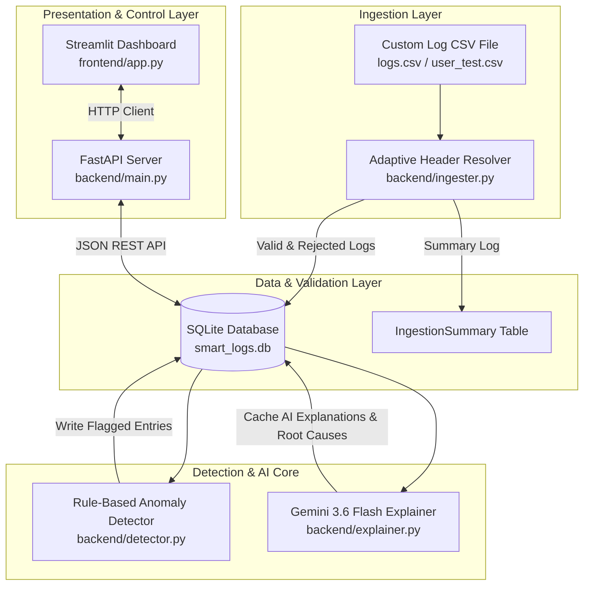

# 🛡️ Smart Log Analyzer & Anomaly Detector MVP

> **Automated, Adaptive Log Parsing, Rule-Based Anomaly Detection, and AI-Powered Root-Cause Insights with Google Gemini 3.6 Flash.**


---

## 📑 Table of Contents
- [🌟 Key Features](#-key-features)
- [📐 System Architecture](#-system-architecture)
- [📥 Adaptive CSV Ingestion Engine](#-adaptive-csv-ingestion-engine)
- [🎯 Anomaly Detector Rules & Logic](#-anomaly-detector-rules--logic)
- [🤖 Gemini AI Root-Cause Explainer](#-gemini-ai-root-cause-explainer)
- [🔌 REST API Endpoint Reference](#-rest-api-endpoint-reference)
- [🖥️ Interactive Dashboard](#-interactive-dashboard)
- [🚀 Quick Start & Setup Guide](#-quick-start--setup-guide)
- [📁 Project Folder Structure](#-project-folder-structure)
- [💡 Design Rationale & Trade-offs](#-design-rationale--trade-offs)

---

## 🌟 Key Features

- 🔄 **Adaptive CSV Column Normalization**: Ingests custom web access logs, firewall logs, or system logs without fixed header names (`IP_Address`, `Status_Code`, `Request_Type`, `User_Agent`, `Session_ID`, `Location`, etc.).
- 🎯 **Deterministic Anomaly Detection (Zero AI Bias)**: Evaluates $100\%$ reproducible rule-based algorithms (`SEVERITY_SPIKE`, `REQUEST_BURST`, `OFF_HOURS_SENSITIVE_ACCESS`, `RARE_EVENT_TYPE`).
- 🤖 **Gemini 3.6 Flash Explainability**: Translates raw detection signals into plain-English root causes and actionable remediation steps.
- ⚡ **Single-Request Batching & Rate-Limit Backoff**: Packs multiple anomalies into a single API request, eliminating HTTP `429 RESOURCE_EXHAUSTED` rate limit errors.
- ⚡ **$O(1)$ Database Query Optimization**: Eliminates $N+1$ DB lookup bottlenecks using single-pass batch flags loading.
- 💾 **SQLite DB Caching**: Caches generated AI explanations persistently so reloading details requires zero API calls.
- 🛡️ **Graceful Degradation**: Retains system stability and displays friendly user warnings if the Gemini API key is missing or rate limited.

---

## 📐 System Architecture



---

## 📥 Adaptive CSV Ingestion Engine

The ingestion module (`backend/ingester.py`) normalizes diverse column names and converts HTTP status codes to system severities automatically.

### Header Synonym Mapping Matrix

| Domain Field | Supported Column Header Synonyms |
| :--- | :--- |
| **Timestamp** | `timestamp`, `datetime`, `time`, `date`, `created_at`, `log_time`, `ts` |
| **Source IP / Host** | `source`, `ip_address`, `ip`, `host`, `client_ip`, `source_ip`, `src`, `hostname`, `user_ip`, `origin` |
| **Event Type / Action**| `event_type`, `request_type`, `action`, `event`, `method`, `path`, `uri`, `command`, `operation`, `type` |
| **Severity / Status** | `severity`, `status_code`, `status`, `level`, `log_level`, `error_level`, `priority` |
| **Raw Message** | `raw_message`, `message`, `user_agent`, `details`, `description`, `log`, `msg` |

### HTTP Status Code Transformation Logic
- `500`, `502`, `503`, `504`, `FATAL`, `CRITICAL` $\rightarrow$ **`CRITICAL`**
- `400`, `401`, `403`, `404`, `ERROR`, `WARNING` $\rightarrow$ **`WARNING` / `ERROR`**
- `200`, `201`, `204`, `301`, `302`, `INFO`, `DEBUG` $\rightarrow$ **`INFO`**

> Any unmapped fields (e.g. `User_Agent`, `Session_ID`, `Location`) are automatically preserved and concatenated into `raw_message` for full auditability.

---

## 🎯 Anomaly Detector Rules & Logic

Rule execution (`backend/detector.py`) is decoupled from AI generation to ensure strict determinism.

| Detector Rule | Score | Condition & Mathematical Rule | Operational Significance |
| :--- | :---: | :--- | :--- |
| **`SEVERITY_SPIKE`** | `1.0` | Log severity is in `{"CRITICAL", "FATAL", "ERROR"}` (including HTTP `500`). | Identifies server crashes, memory exhaustion, database connection pool depletion, and critical hardware failures. |
| **`REQUEST_BURST`** | `0.9` | Single source IP/Host issues $\ge 10$ requests within a rolling **60-second window**. | Detects denial-of-service (DoS) attempts, web scrapers, infinite application loops, and high-frequency script bugs. |
| **`OFF_HOURS_SENSITIVE_ACCESS`**| `0.85` | Sensitive actions (`SENSITIVE_DATA_EXPORT`, `CONFIGURATION_WRITE`, `SYSTEM_OVERRIDE`, `ENCRYPTION_KEY_DESTROYED`, `DELETE`, `DROP`) performed between **10 PM and 5 AM**. | Flags credential abuse, data exfiltration, or out-of-schedule administrative destructions. |
| **`RARE_EVENT_TYPE`** | `0.75` | Event type occurrence frequency is $< 2\%$ of the total valid records loaded. | Highlights rarely executed system commands or obscure endpoints requiring manual security auditing. |

---

## 🤖 Gemini AI Root-Cause Explainer

The explainability engine (`backend/explainer.py`) utilizes the official **Google GenAI SDK** (`google-genai`) with **`gemini-3.6-flash`**.

- **Single-Request Batching**: `/analyze-all-anomalies` packs multiple flagged entries into a single structured JSON prompt, requesting AI analysis for the entire batch in **1 single API call**. This bypasses free-tier 15 RPM rate limits.
- **Exponential Backoff**: Single-entry requests include automated retry loops (`time.sleep(2.0 * attempt)`) to handle rate limit spikes cleanly.
- **Persistent DB Caching**: AI explanations (`ai_explanation`) and remediation steps (`ai_root_cause`) are saved directly in `FlaggedEntry` records in SQLite.
- **Dynamic `.env` Reloading**: Calls `load_dotenv(override=True)` before making API requests so changes to `GEMINI_API_KEY` take effect instantly without restarting the server.

---

## 🔌 REST API Endpoint Reference

FastAPI runs on `http://127.0.0.1:8000` (`backend/main.py`).

| Method | Endpoint | Request Payload / Params | Description |
| :---: | :--- | :--- | :--- |
| `POST` | `/ingest` | `file`: CSV file multipart/form-data | Ingests a custom CSV, runs validation, and triggers rule detection. |
| `POST` | `/ingest-default` | None | Loads pre-synthesized `data/logs.csv` directly from storage. |
| `GET` | `/logs` | None | Retrieves all log entries (valid and invalid) sorted by timestamp. |
| `GET` | `/flagged` | None | Retrieves all flagged anomalies sorted by anomaly score. |
| `GET` | `/flagged/{id}` | `id`: Integer (Flagged Entry ID) | Retrieves anomaly details and triggers Gemini AI explanation if un-cached. |
| `POST` | `/analyze-all-anomalies`| None | Runs single-request batch Gemini AI analysis on all unanalyzed anomalies. |
| `GET` | `/summaries` | None | Returns ingestion summary logs (loaded vs rejected counts). |
| `POST` | `/clear` | None | Wipes all database tables for a clean restart test case. |

---

## 🖥️ Interactive Dashboard

Built using Streamlit (`frontend/app.py`).

1. **Metrics Cards**: Displays Total Logs Processed, Valid Log Entries, Malformed/Rejected Rows, and Flagged Anomalies.
2. **Full-Width Timeline Table**: Displays full log records with real-time status badges (`🚨 ANOMALY`, `✅ NORMAL`, `❌ INVALID`), detector rules, inline anomaly reasons, and AI explanations.
3. **AI Anomaly Analyzer Table**: Dedicated summary table presenting all flagged anomalies alongside Gemini AI root-cause diagnoses and actionable steps.
4. **Dropdown Inspection Panel**: Select any flagged anomaly to inspect metadata key-value tables and Gemini AI troubleshooting cards.
5. **Validation Error Inspector**: Collapsible view for inspecting rejected/malformed rows.

---

## 🚀 Quick Start & Setup Guide

### 1. Prerequisites
- Python 3.10 or higher
- Pip package manager

### 2. Environment Configuration
Set your Gemini API Key in your environment or `.env` file:
```powershell
# Windows (PowerShell):
$env:GEMINI_API_KEY="your-gemini-api-key-here"

# Linux / macOS:
export GEMINI_API_KEY="your-gemini-api-key-here"
```

### 3. Generate Synthetic Dataset
Generate `data/logs.csv` (contains 200 normal logs, 20 deliberate anomalies, and 3 malformed validation test rows):
```bash
python backend/synthesizer.py
```

### 4. Start Backend API Server
```bash
uvicorn backend.main:app --port 8000 --reload
```

### 5. Start Frontend Application
In a separate terminal window:
```bash
streamlit run frontend/app.py --server.port 8501
```
Open your browser at **[http://localhost:8501](http://localhost:8501)**.

---

## 📁 Project Folder Structure

```text
HACKATHON/
├── backend/
│   ├── database.py       # SQLAlchemy engine & SQLite session configuration
│   ├── detector.py       # Rule-based anomaly detection engine (O(1) batch query optimized)
│   ├── explainer.py      # Gemini 3.6 Flash AI integration & single-request batching
│   ├── ingester.py       # Adaptive CSV parser & synonym column normalizer
│   ├── main.py           # FastAPI REST API routes & CORS middleware
│   ├── models.py         # SQLAlchemy ORM database models
│   ├── schemas.py        # Pydantic v2 schemas for API requests/responses
│   └── synthesizer.py    # Synthetic dataset generator script
├── data/
│   └── logs.csv          # Pre-generated synthetic log dataset
├── frontend/
│   └── app.py            # Interactive Streamlit dashboard UI
├── temp/                 # Temporary file storage for uploaded CSVs
├── .env                  # Environment configuration file (GEMINI_API_KEY)
├── CHECKLIST.MD          # Grading checklist & verification benchmarks
├── README.md             # Project documentation & GitHub guide
└── smart_logs.db         # Persistent SQLite database file
```

---

## 💡 Design Rationale & Trade-offs

- **Why Rule-Based Detection Over Pure AI Detection?**
  Using LLMs directly for anomaly classification introduces non-deterministic outputs, API latency, high costs, and hallucination risks. Decoupling detection (rule engine) from explanation (LLM) guarantees $100\%$ deterministic flagging while leveraging Gemini's strengths in plain-English translation and root-cause reasoning.
- **Why Single-Request Batching for AI Analysis?**
  Free-tier Gemini API keys enforce a limit of **15 Requests Per Minute (RPM)**. Generating explanations sequentially for 20 anomalies triggers HTTP `429 RESOURCE_EXHAUSTED` rate limits. Sending 1 single JSON batch prompt achieves full AI analysis in a single request (~2 seconds total).
- **Why SQLite for Persistence?**
  SQLite is zero-config, embedded, and lightweight, making the application run from a clean clone without requiring external database server installations.

